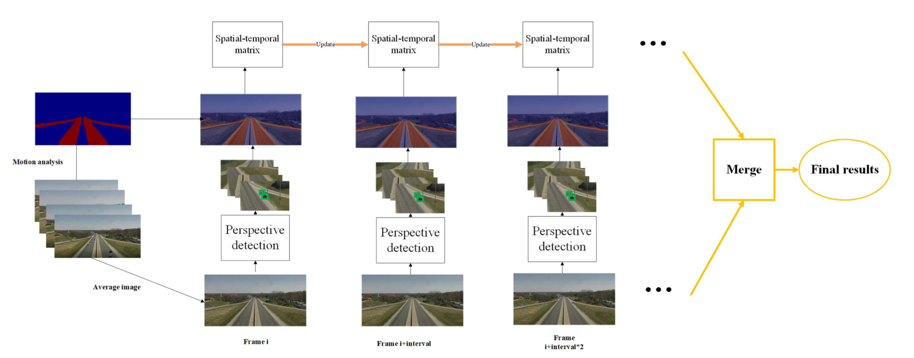

## Traffic Anomaly Detection via Perspective Map based on Spatial-temporal Information Matrix

This repository contains our source code of Track-3 in the NVIDIA AI City Challenge at CVPR 2019 Workshop.

### Introduction

#### NVIDIA AICity Challenge 2019 Track3

The challenge Track 3  of NVIDIA AI CITY 2019 required participating teams to submit the anomalies detected based on video feeds available from multiple cameras at intersections and along highways. 

Detailed information of NVIDIA AICity Challenge 2019 can be found [here](https://www.aicitychallenge.org/).

Overview of the architecture of our anomaly detection framework, which consists of background modeling module, perspective detection module, and spatial-temporal matrix discriminating module.
### Requirements

- Linux (tested on CentOS 7.2)
- Python 3.6
- PyTorch 0.4.1
- Opencv
- sklearn
- [mmcv](https://github.com/open-mmlab/mmcv)
- [mmdetection](https://github.com/open-mmlab/mmdetection)

### Installation

1. Install PyTorch 0.4.1 and torchvision following the [official instructions](https://pytorch.org/).
2. Install [mmdetection@(pytorch0.4.1)](https://github.com/open-mmlab/mmdetection/tree/pytorch-0.4.1) and mmcv following the [official instructions](https://github.com/open-mmlab/mmdetection/blob/pytorch-0.4.1/INSTALL.md).
3. Download the model weights and precaculated detection results from here.

### Test video(s)

Since it takes a long time to run this system, we split the task into several steps and provide precalculated results.
1. Run `python ./capture_and_average.py`. Then, you will get all original frames and superimposed frames saved in `./data/ori_images` and `./data/processed_images` separately.
2. Put the downloaded detection and reid models into `./models`, and put precaculated detection results into `./detection_results`.
3. To test a video and show the result.
`python ./detect_anomaly.py <video id>`
To test all videos and save the results.
`sh detect_all_videos.sh >tarck3.txt`

### Citation

